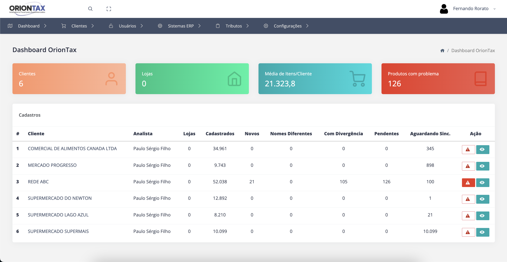

# Sistema de Integração Tributária de Produtos para Supermercados

## Pré-Requisitos

- Python 3.12
- PostgreSQL
- Composer

## Visão Geral

O **Sistema de Integração Tributária de Produtos para Supermercados** é uma solução desenvolvida para simplificar e otimizar a gestão tributária de produtos comercializados por supermercados no Brasil. O sistema realiza o acompanhamento e a validação de impostos como ICMS, PIS e COFINS, garantindo conformidade fiscal e reduzindo erros nas operações.

## 📋 Funcionalidades Principais

### 💼 Cadastro e Gerenciamento
- Cadastro de Contabilidades: Organização e armazenamento centralizado das informações fiscais de cada supermercado.
- Regras Fiscais Personalizadas: Configuração de alíquotas e regras tributárias específicas para cada tipo de produto.
- Gerenciamento de Impostos: Controle detalhado dos tributos aplicáveis, permitindo ajustes dinâmicos conforme legislações.
### 🔍 Validação de Produtos
- Recepção de Dados do Supermercado: Integração com os sistemas de ERP dos supermercados para receber informações dos produtos.
- Classificação Automática:
    - Produto OK: Todos os dados estão em conformidade.
    - Produto Novo: Produto ainda não cadastrado no sistema.
    - Produto com Problemas: Necessita revisão manual por parte da equipe responsável.
- Feedback Imediato: Indicação clara sobre a situação de cada produto, agilizando o processo de regularização tributária.
### 🔄 Integração e Retorno de Dados
- Envio de Produtos Validados: Após a validação, os dados dos produtos são enviados de volta ao supermercado por meio de integrações flexíveis:
    - API dedicada.
    - Banco de dados customizado.
    - Dropbox ou outros métodos suportados pelos ERPs.
### 🌐 API Pública
O sistema também oferece uma API robusta para integração com sistemas externos, permitindo automações personalizadas e interações bidirecionais.
👉 Acesse a documentação completa da API: [Documentação da API](https://documenter.getpostman.com/view/1113377/2sA3s4mAjX)

### 🚀 Benefícios
- Conformidade Fiscal: Reduz riscos de autuações tributárias e multas, garantindo que os produtos atendam às normas fiscais.
- Eficiência Operacional: Automatiza a validação de impostos, liberando tempo para a equipe focar em atividades mais estratégicas.
- Flexibilidade de Integração: Funciona com diferentes ERPs, adaptando-se às necessidades de cada supermercado.
### 🛠 Tecnologias Utilizadas
- Backend: Python/Django
- Banco de Dados: PostgreSQL
- Integrações: APIs REST, serviços de armazenamento em nuvem e bancos de dados intermediários.
